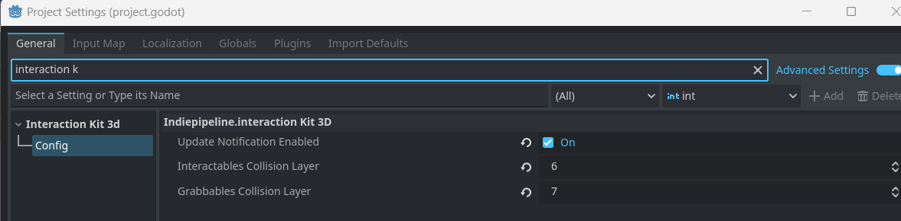
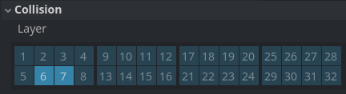

<div align="center">
	

<h3 align="center">Interaction KIT 3D</h3>

  <p align="center">
   A versatile interaction toolkit for 3D worlds. Easily create dynamic interactions like picking up, throwing, and more.
	<br />
	·
	<a href="https://github.com/ninetailsrabbit/interaction-kit-3d/issues/new?assignees=ninetailsrabbit&labels=%F0%9F%90%9B+bug&projects=&template=bug_report.md&title=">Report Bug</a>
	·
	<a href="https://github.com/ninetailsrabbit/interaction-kit-3d/issues/new?assignees=ninetailsrabbit&labels=%E2%AD%90+feature&projects=&template=feature_request.md&title=">Request Features</a>
  </p>
</div>

<br>
<br>

- [📦 Installation](#-installation)
- [Configure layers](#configure-layers)
- [GlobalInteraction3D](#globalinteraction3d)
- [⭕ Interactable3D](#-interactable3d)
  - [Signals](#signals)
  - [Properties](#properties)
  - [Outline](#outline)
    - [By shader](#by-shader)
    - [Inverted hull](#inverted-hull)
- [⭕ RayCastInteractor3D](#-raycastinteractor3d)
  - [Properties](#properties-1)
  - [How to use](#how-to-use)
- [⭕ MouseRayCastInteractor3D](#-mouseraycastinteractor3d)
  - [Properties](#properties-2)

# 📦 Installation

1. [Download Latest Release](https://github.com/ninetailsrabbit/interaction-kit-3d/releases/latest)
2. Unpack the `addons/ninetailsrabbit.interaction-kit-3d` folder into your `/addons` folder within the Godot project
3. Enable this addon within the Godot settings: `Project > Project Settings > Plugins`

To better understand what branch to choose from for which Godot version, please refer to this table:
|Godot Version|Interaction Kit 3D Branch|Interaction Kit 3D Version|
|---|---|--|
|[](https://godotengine.org/)|`main`|`1.x`|

# Configure layers

Once this plugin it's enabled you need to configure the layers configuration _(Advanced settings checkbox needs to be enabled)_ where the `Interactables & Grabbables` will be.

By default `Interactables` are on layer 6 and `Grabbables` are on layer 7.



---



# GlobalInteraction3D

This plugin provides a `GlobalInteraction3D` singleton designed to react to the different interactables in your game via signals. It have access to all the interactables & grabbables and this are the available signals to connect:

```swift
//region Interactables

signal interactable_focused(interactable: Interactable3D)
signal interactable_unfocused(interactable: Interactable3D)
signal interactable_interacted(interactable: Interactable3D)
signal interactable_canceled_interaction(interactable: Interactable3D)
signal interactable_interaction_limit_reached(interactable: Interactable3D)
signal canceled_interactable_scan(interactable: Interactable3D)

//endregion

//region Picking

signal grabbable_focused(grabbable: Grabbable3D)
signal grabbable_unfocused(grabbable: Grabbable3D)

//endregion
```

**_It is intended for you to display information on the screen mainly from other UI nodes but its uses are up to you_**

# ⭕ Interactable3D

The `Interactable3D` node, which inherits from `Area3D`, serves as the foundation for creating interactive objects within your Godot game. It provides properties and signals for handling player interaction through various means.

**_Important Note:_**
_Interactable nodes should not contain any logic beyond emitting the appropriate signals and acting as a data container for interaction-related information._

## Signals

```swift
signal interacted() // Emitted when a valid interactor interacts with this object
signal focused() // Emitted when a valid interactor focuses on this object (e.g., hovering with a cursor)
signal unfocused() // Emitted when a valid interactor loses focus on this object
signal canceled_interaction() // Emitted when a valid interactor cancels interaction with this object
signal interaction_limit_reached() // Emitted when the number of limits defined for this interactable is reached
```

## Properties

All the properties except `disable_after_interaction` and `number_of_times_can_be_interacted` does not alter the state of the `Interactable3D` and only act as a **data container** to react wherever this interactable is connected

```swift
// When this is enabled, the interactable area is activated when enter the scene tree
@export var activate_on_start: bool = true

// Disable immediately this interactable after the first interaction
@export var disable_after_interaction: bool = false

// The limited amount of times this interactable can be interacted with. Set to 0 to no-limit
@export var number_of_times_can_be_interacted: int = 0

// When this interactable it's focused, the cursor needs to be changed. This is only an information property and does not change the cursor inside the interactable
@export var change_cursor: bool = true

// When this interactable it's focused, the screen pointer needs to be changed. and does not change the screen pointer inside the interactable.
@export var change_screen_pointer: bool = true

// Defines if the player movement it's locked when interacting with this interactable.
@export var lock_player_on_interact: bool = false


@export_group("Information")
@export var id: String = ""
@export var title: String = ""
@export var description: String = ""
@export var title_translation_key: String = ""
@export var description_translation_key: String = ""


@export_group("Scan")
@export var scannable: bool = false
@export var can_be_rotated_on_scan: bool = true
@export var target_scannable_object: Node3D


@export_group("Screen pointers")
@export var focus_screen_pointer: CompressedTexture2D
@export var interact_screen_pointer: CompressedTexture2D

@export_group("Cursors")
@export var focus_cursor: CompressedTexture2D
@export var interact_cursor: CompressedTexture2D
@export var scan_rotate_cursor: CompressedTexture2D

```

## Outline

An outline can be automatically applied if they are related to a `MeshInstance3D`.

```swift

enum OutlineMode {
	EdgeShader,
	InvertedHull
}

@export_group("Outline")
@export var interactable_mesh: MeshInstance3D
@export var outline_mode: OutlineMode = OutlineMode.EdgeShader
@export var outline_on_focus: bool = true

```

### By shader

This technique uses the shader from [https://godotshaders.com/shader/pixel-perfect-outline-shader/](https://godotshaders.com/shader/pixel-perfect-outline-shader/) by default

```swift

@export_category("Edge shader") // https://www.videopoetics.com/tutorials/pixel-perfect-outline-shaders-unity/

@export var outline_shader_color: Color = Color.WHITE
@export var outline_width: float = 2.0
@export var outline_shader: Shader = preload("res://addons/ninetailsrabbit.interaction_kit_3d/src/outline/pixel_perfect_outline.gdshader")


```

### Inverted hull

This technique creates an outline by duplicating the mesh material and inflating it slightly, resulting in a thicker border effect.

```swift
@export_category("Inverted hull")
@export var outline_hull_color: Color = Color.WHITE
@export_range(0, 16, 0.01) var outline_grow_amount: float = 0.02

```

# ⭕ RayCastInteractor3D

The `RayCastInteractor3D` node, inheriting from `RayCast3D`, serves as the player's interaction mechanism in your Godot game. It detects nearby interactable objects and relays interaction events through signals.

Overall, the `RayCastInteractor3D` node bridges the gap between player input and object interaction in your Godot game. It manages focus, handles interaction initiation and cancellation, and relays events to interactable objects for further processing.

## Properties

This node only needs the input map actions related, if they do not exist, the interactor will not be able to trigger the interactables **but it will detect them with the focus.**

```swift
@export var interact_input_action: String = "interact"
@export var cancel_interact_input_action: String = "cancel_interact"

```

## How to use

- **Add it to the Scene:** Place an `RayCastInteractor3D` node in the scene hierarchy, typically attached to the player node.
- **Set Input Action:** In the Inspector window, locate the `input_action` property under Exports for the `Interactor3D` node. Choose the action name _(e.g., "interact")_ that will trigger interaction when the player focuses on an interactable object.

That's it! The `RayCastInteractor3D` will automatically handle raycasting, focus management, and interaction signals.

# ⭕ MouseRayCastInteractor3D

The `MouseRayCastInteractor3D` node serves as a mouse-based interaction mechanism for your Godot game. It leverages the player's mouse position and a specified camera to cast a raycast and detect interactable objects.

The[ Mouse Mode](https://docs.godotengine.org/es/4.x/classes/class_input.html#class-input-property-mouse-mode) needs to be `Input.MOUSE_MODE_VISIBLE` or `Input.MOUSE_MODE_CONFINED` to work as expected.

## Properties

```swift
// A reference to the camera used for projecting the mouse raycast.
@export var origin_camera: Camera3D

// The maximum distance covered by the raycast _(defaults to 1000.0)_.
@export var ray_length: float = 1000.0

// The mouse button used to trigger interaction _(defaults to MOUSE_BUTTON_LEFT for left click)._
@export var interact_mouse_button = MOUSE_BUTTON_LEFT
@export var cancel_interact_input_action: String = "cancel_interact"

```

**How to use**

- **Add it to the Scene:** Place an `MouseRayCastInteractor3D` node in the scene hierarchy, typically attached to the player node.
- **Set the ray length**: The ray length is the distance from the center of the camera into the world, higher values cover more distance.
- **Set the interact button**: Exactly the same as input action on `Interactable3D` but this case the default it's the mouse left button.
- **Set the collision mask**: This repository by default uses the 8 for interactables, change it for your game requirements _(maybe your interactables layer it's 32 or multiple ones)_

That's it! The `MouseRayCastInteractor3D` will automatically handle raycasting, focus management, and interaction signals based on the mouse position.
